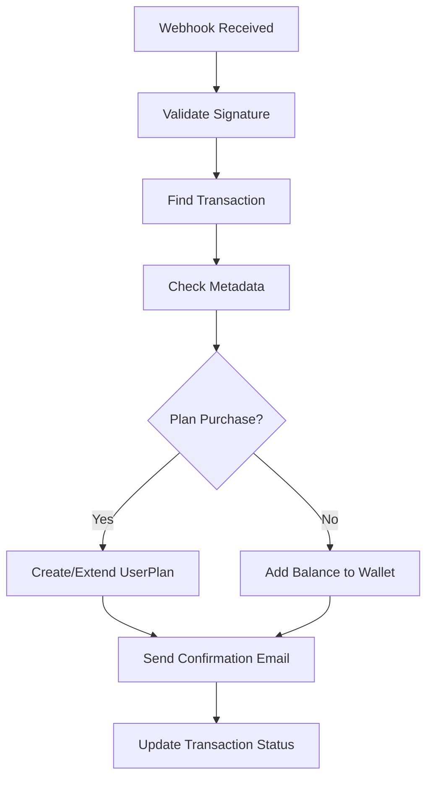
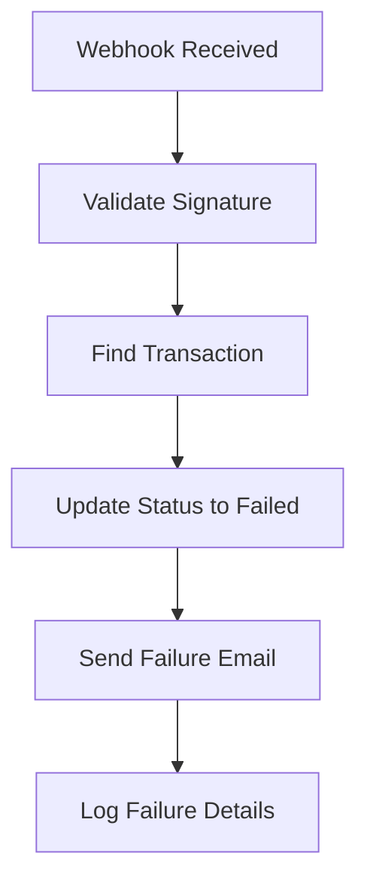

# NOWPayments Webhook Integration with UserPlan Creation

## Overview

This document describes the enhanced NOWPayments webhook system that automatically creates UserPlan entries after successful crypto payments. The system handles both plan purchases and regular deposits with comprehensive logging and error handling.

## New Features

### 1. Plan-Specific Payment Creation
- **Endpoint**: `POST /api/nowpayments/create-plan-payment`
- **Purpose**: Create payments specifically for plan purchases
- **Validation**: Ensures plan exists, is active, and price matches payment amount

### 2. Enhanced Webhook Processing
- **Automatic UserPlan Creation**: Creates plan entries after successful payments
- **Smart Plan Handling**: Extends existing plans or creates new ones
- **Comprehensive Logging**: Detailed logs for all payment scenarios

### 3. Test Webhook Endpoint
- **Endpoint**: `POST /api/nowpayments/test-webhook`
- **Purpose**: Test webhook processing without real NOWPayments calls
- **Use Cases**: Development, testing, debugging

## API Endpoints

### Create Plan Payment
```http
POST /api/nowpayments/create-plan-payment
Authorization: Bearer <token>
Content-Type: application/json

{
  "planId": 1,
  "payCurrency": "btc",
  "priceCurrency": "usd"
}
```

**Response:**
```json
{
  "message": "Plan payment created successfully",
  "payment": {
    "paymentId": "payment_id_from_nowpayments",
    "payAddress": "crypto_address",
    "payAmount": "0.001",
    "payCurrency": "btc",
    "priceAmount": "100",
    "priceCurrency": "usd",
    "orderId": "NOW_PLAN_1234567890_123",
    "status": "waiting",
    "transactionId": 456,
    "referenceId": "NOW_PLAN_1234567890_123",
    "plan": {
      "id": 1,
      "name": "Basic Plan",
      "price": "100.00",
      "features": ["Feature 1", "Feature 2"]
    }
  }
}
```

### Test Webhook
```http
POST /api/nowpayments/test-webhook
Content-Type: application/json

{
  "transactionId": 123,
  "paymentStatus": "confirmed"
}
```

**Supported Statuses:**
- `confirmed` / `finished` - Payment successful
- `failed` - Payment failed
- `expired` - Payment expired

## Webhook Processing Flow

### 1. Payment Success (`confirmed` / `finished`)



**What Happens:**
1. **Transaction Update**: Status → `completed`, `processedAt` set
2. **Plan Processing**: 
   - If plan purchase: Create/Extend UserPlan
   - If regular deposit: Add balance to wallet
3. **Email Notification**: Send appropriate confirmation email
4. **Logging**: Comprehensive logs for monitoring

### 2. Payment Failure (`failed` / `expired`)



**What Happens:**
1. **Transaction Update**: Status → `failed`, `processedAt` set
2. **Failure Email**: Notify user about payment failure
3. **Logging**: Record failure details for debugging

## Database Changes

### Transaction Model Enhancements
- **`metadata` field**: Stores plan information for plan purchases
- **Enhanced descriptions**: More descriptive transaction descriptions
- **Plan tracking**: Links transactions to specific plans

### UserPlan Automatic Creation
- **Automatic creation**: UserPlan entries created after successful payments
- **Smart expiry handling**: Extends existing plans or creates new ones
- **Payment method tracking**: Records crypto payment method
- **Transaction linking**: Links UserPlan to payment transaction

## Frontend Integration

### New API Methods
```javascript
import { nowpaymentsAPI } from '@/services/api';

// Create plan payment
const planPayment = await nowpaymentsAPI.createPlanPayment({
  planId: 1,
  payCurrency: 'btc',
  priceCurrency: 'usd'
});

// Test webhook (for development)
const webhookTest = await nowpaymentsAPI.testWebhook({
  transactionId: 123,
  paymentStatus: 'confirmed'
});
```

### Plan Purchase Flow
1. **User selects plan** from plans page
2. **Frontend calls** `createPlanPayment` endpoint
3. **Payment created** with plan metadata
4. **User completes payment** via NOWPayments
5. **Webhook processes** payment automatically
6. **UserPlan created** and user notified

## Error Handling

### Webhook Failures
- **Invalid signatures**: Return 401, log security warning
- **Transaction not found**: Return 404, log error
- **Plan creation failures**: Log error but don't fail webhook
- **Email failures**: Log error but continue processing

### Payment Validation
- **Plan existence**: Verify plan exists and is active
- **Price matching**: Ensure payment amount matches plan price
- **User validation**: Check user exists and has required wallets
- **Duplicate prevention**: Prevent duplicate active plans

## Logging and Monitoring

### Success Logs
```
🎉 Payment confirmed! Processing plan assignment...
📋 Creating UserPlan entry for plan: 1
✅ UserPlan created successfully: 123
📧 Plan purchase confirmation email sent
```

### Error Logs
```
❌ Error creating UserPlan: Validation error
⚠️ User already has this plan active, extending expiry
❌ Plan not found: 999
```

### Test Logs
```
🧪 Testing webhook processing...
🎉 Simulating successful payment...
📋 Creating UserPlan entry for plan: 1
✅ Test UserPlan created successfully: 123
```

## Testing

### Manual Testing
1. **Create plan payment** using `create-plan-payment` endpoint
2. **Test webhook** using `test-webhook` endpoint
3. **Verify UserPlan** creation in database
4. **Check logs** for proper processing

### Automated Testing
```bash
# Run webhook integration tests
cd backend
node test-webhook-integration.js

# Run existing NOWPayments tests
node test-nowpayments.js
```

## Security Considerations

### Webhook Validation
- **Signature verification**: HMAC-SHA512 validation
- **IPN secret**: Secure secret key for webhook validation
- **HTTPS only**: All webhook endpoints require HTTPS

### Data Validation
- **Input sanitization**: All inputs validated and sanitized
- **Plan verification**: Plans verified before processing
- **User authentication**: Proper user authentication required

## Deployment Notes

### Environment Variables
```env
NOWPAYMENTS_API_KEY=your-api-key
NOWPAYMENTS_IPN_SECRET=your-ipn-secret
BACKEND_URL=https://your-domain.com
```

### Webhook URL
- **Production**: `https://your-domain.com/api/nowpayments/webhook`
- **Development**: `http://localhost:3000/api/nowpayments/webhook`

### Database Migration
- **No new migrations required** - uses existing fields
- **Metadata field**: Already exists in Transaction model
- **UserPlan model**: No changes required

## Troubleshooting

### Common Issues

1. **UserPlan not created**
   - Check transaction metadata
   - Verify plan exists and is active
   - Check webhook logs for errors

2. **Webhook signature validation fails**
   - Verify `NOWPAYMENTS_IPN_SECRET` environment variable
   - Check webhook URL configuration
   - Ensure HTTPS in production

3. **Plan price mismatch**
   - Verify plan price in database
   - Check payment amount validation
   - Ensure plan is active

### Debug Endpoints
- **Test webhook**: `/api/nowpayments/test-webhook`
- **Public test**: `/api/nowpayments/test-public`
- **Health check**: `/health`

## Support

For issues or questions:
1. Check webhook logs for detailed error information
2. Use test webhook endpoint for debugging
3. Verify environment variables and configuration
4. Check database for transaction and UserPlan records
